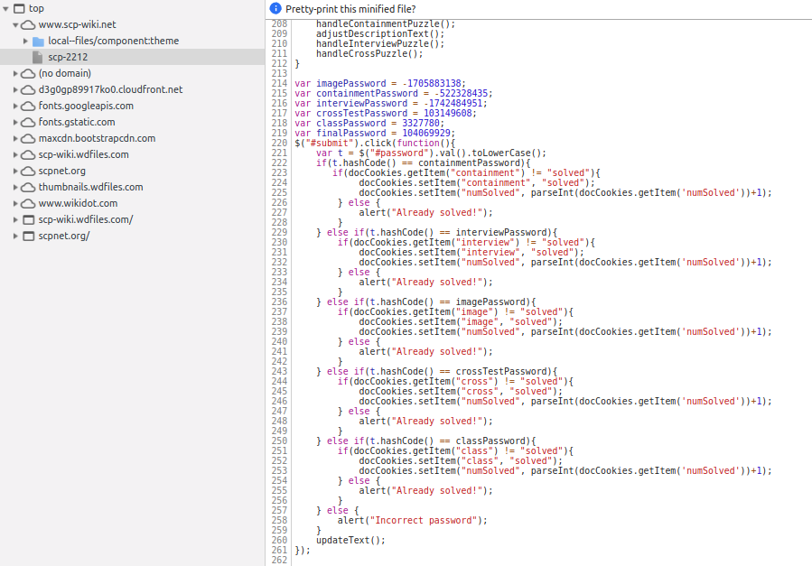

# 2212-solver
Brute-force hash solver for the SCP-2212 puzzle

## About the Puzzle
[SCP-2212](http://www.scp-wiki.net/scp-2212) presents information about a fictional reality-bending entity with much of the information redacted, and only accessible by entering passwords which can be discovered by solving various puzzles linked from the webpage.

Not wanting to go to the effort of solving these puzzles, I decided to look through the various source elements, finding a password verifier in the form of a simple hash. Fortunately, the hash converts everything to  lower-case ASCII, reducing the possible entries to something feasibly brute-forced.

Note that the password variables shown have already been put through the hash, and cannot be entered directly.

Armed with the hash algorithm located in the same file, and knowledge of the necessary outputs, I put together a C file that interates through all combinations of lower-case ASCII characters until a solution is found. It is ugly, but it works and probably took less effort than actually solving the puzzles.

## Found Solutions (No Spoilers)
The solutions found by this code were **not** the intended solutions, but they do all work. The passwords listed below do not spoil any puzzle solutions, and will allow access to the hidden information on the web page.

imagePassword: ejtyglm
containmentPassword: pkatwpt
interviewPassword: eilesex
crossTestPassword: gkztksn
classPassword: ghkqswo